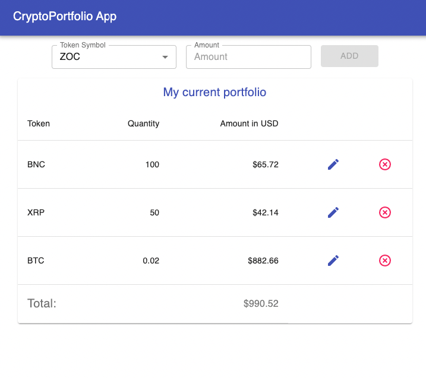
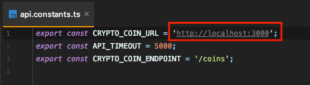

## Description

[CryptoPortfolioApp](https://github.com/gusilva/coin-client) Crypto portfolio single page App.



## Installation

```bash
$ npm install
```

## Configuration

Change the `CRYPTO_COIN_URL` in the `src/api/api.constants.ts` file. This ULR should be the [CryptoPortfolioAPI](https://github.com/gusilva/crypto-server) URL.



## Running the app

```bash
# development
$ npm run start
```

## Stay in touch

- Author - [Silva Gustavo](https://gu-silva.com)

## License

CryptoPortfolioApp is [MIT licensed](LICENSE).
